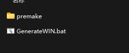

# NRenderGL

Language: C++
Manager: PreMake
Status: Not started

本案例使用Premake分项目进行整理

克隆项目文件，打开Script，运行bat文件

将在跟目录获得.sln文件

案例运行

<aside>
✨ 部分项目GLFW的配置不同，可能在编译中会出现未定义引用的问题

本项目在GLFW.lua中修复了部分文件引用的问题

可以作为使用GLFW源码的参考

</aside>
